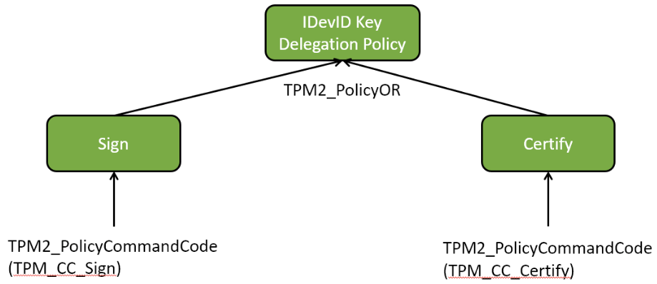
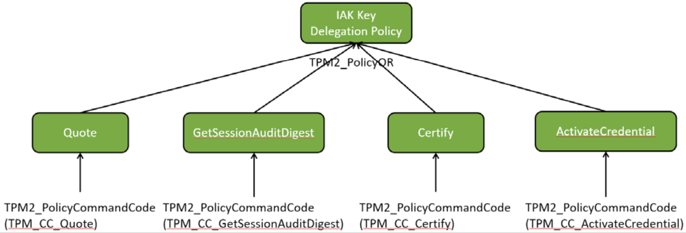

# Remote Attestation Examples

This folder contains examples for performing remote attestation. You will learn how to perform a challenge-response between an end node and attestation server.

## List of examples

The `./examples/attestation/` folder contains examples related specifically to remote attestation. However, the demonstration requires the creation of TPM 2.0 keys using the `keygen` example also included in wolfTPM's source code.

Complete list of the required examples is shown below:

* `./examples/attestation/make_credential`: Used by a server to create a remote attestation challenge
* `./examples/attestation/activate_credential`: Used by a client to decrypt the challenge and respond
* `./examples/attestation/certify`: Used to certify (attest) or prove an object with name is loaded in the TPM.
* `./examples/keygen/create_primary`: Used to create a primary key(PK) and attestation key(AK)

Note: All of these example allow the use of the Endorsement Key and Attestation Key under the Endorsement Hierarchy. This is done by adding the `-eh` option when executing any of the three examples above. The advantage of using EK/EH is that the private key material of the EK never leaves the TPM. Anything encrypted using the public part of the EK can be encrypted only internally by the TPM owner of the EK, and EK is unique for every TPM chip. Therefore, creating challenges for Remote Attestation using the EK/EH has greater value in some scenarios. One drawback is that by using the EK the identity of the host under attestation is always known, because the EK private-public key pair identifies the TPM and in some scenarios this might rise privacy concerns. Our remote attestation examples support both AK under SRK and AK under EK. It is up to the developer to decide which one to use.

## Technology introduction

Remote Attestation is the process of a client providing an evidence to an attestation server that verifies if the client is in a known state.

For this process to take place, the client and server must establish initial trust. This is achieved using the standard TPM 2.0 commands MakeCredential and ActivateCredential.

1. The client transfers the public parts of a TPM 2.0 Primary Attestation Key(PAK) and quote signing Attestation Key(AK).

2. MakeCredential uses the public part of the PAK to encrypt a challenge(secret). Typically, the challenge is a digest of the public part of an Attestation Key(AK).

This way the challenge can only be decrypted by the TPM that can load the private part of the PAK and AK. Because the PAK and AK are bound to the TPM using a fixedTPM key attribute, the only TPM that can load these keys is the TPM where they were originally created.

3. After the challenge is created, it is transferred from the server to the client.

4. ActivateCredential uses the TPM 2.0 loaded PAK and AK to decrypt the challenge and retrieve the secret. Once retrieved, the client can respond to the server challenge.

This way the client confirms to the server it possesses the expected TPM 2.0 System Identity and Attestation Key.

Note:

* The transport protocol to exchange the challenge and response are up to the developer to choose, because this is implementation specific. One approach could be the use of TLS1.3 client-server connection using wolfSSL.

## Example usage

### Creating TPM 2.0 keys for Remote Attestation

Using the `keygen` example we can create the necessary TPM 2.0 Attestation Key and TPM 2.0 Primary Storage Key that will be used as a Primary Attestation Key(PAK).

```
$ ./examples/keygen/keygen -rsa
TPM2.0 Key generation example
	Key Blob: keyblob.bin
	Algorithm: RSA
	Template: AIK
	Use Parameter Encryption: NULL
Loading SRK: Storage 0x81000200 (282 bytes)
RSA AIK template
Creating new RSA key...
New key created and loaded (pub 280, priv 222 bytes)
Wrote 508 bytes to keyblob.bin
Wrote 288 bytes to srk.pub
Wrote AK Name digest
```

### Make Credential Example Usage

Using the `make_credential` example an attestation server can generate remote attestation challenge. The secret is 32 bytes of randomly generated seed that could be used for a symmetric key in some remote attestation schemes.

```
$ ./examples/attestation/make_credential
Using public key from SRK to create the challenge
Demo how to create a credential challenge for remote attestation
Credential will be stored in cred.blob
wolfTPM2_Init: success
Reading 288 bytes from srk.pub
Reading the private part of the key
Public key for encryption loaded
Read AK Name digest success
TPM2_MakeCredential success
Wrote credential blob and secret to cred.blob, 648 bytes
```

The transfer of the PAK and AK public parts between the client and attestation server is not part of the `make_credential` example, because the exchange is implementation specific.

### Activate Credential Example Usage

Using the `activate_credential` example a client can decrypt the remote attestation challenge. The secret will be exposed in plain and can be exchanged with the attestation server.

```
$ ./examples/attestation/activate_credential
Using default values
Demo how to create a credential blob for remote attestation
wolfTPM2_Init: success
Credential will be read from cred.blob
Loading SRK: Storage 0x81000200 (282 bytes)
SRK loaded
Reading 508 bytes from keyblob.bin
Reading the private part of the key
AK loaded at 0x80000001
Read credential blob and secret from cred.blob, 648 bytes
TPM2_ActivateCredential success
```

The transfer of the challenge response containing the secret in plain (or used as a symmetric key seed) is not part of the `activate_credential` example, because the exchange is also implementation specific.

### Certify Example

The certify example shows how to use the `TPM2_Certify` API to sign the attestation info for another key. This can be used to prove that an object with a specific name is loaded into the TPM. A common example of this is using the restricted IAK to sign the attestation information for the IDevID.

The create_primary example support creating RSA or ECC initial device identity (IDevID) and attestation identity (IAK) keys. These are created under the endorsement hierarchy and follow the "TPM 2.0 Keys for Device Identity and Attestation" TCG specification for setting up the primary key policies. Figures 10 and 11 fom this specification shows the IAK/IDevID policy.





The IDevID key can be used for external non-restrictive signing.
The IAK is used for internal attestation.

Here we use the IAK to certify the attestation information for the IDevID key.

```sh
% ./examples/keygen/create_primary -rsa -eh -iak -keep
TPM2.0 Primary Key generation example
        Algorithm: RSA
        Unique: IAK
        Store Handle: 0x00000000
        Use Parameter Encryption: NULL
Creating new RSA primary key...
Create Primary Handle: 0x80000000

% ./examples/keygen/create_primary -rsa -eh -idevid -keep
TPM2.0 Primary Key generation example
        Algorithm: RSA
        Unique: IDEVID
        Store Handle: 0x00000000
        Use Parameter Encryption: NULL
Creating new RSA primary key...
Create Primary Handle: 0x80000001

% ./examples/attestation/certify -rsa -certify=0x80000001 -signer=0x80000000
Certify 0x80000001 with 0x80000000 to generate TPM-signed attestation info
EK Policy Session: Handle 0x3000000
TPM2_Certify complete
Certify Info 172
RSA Signature: 256

% ./examples/management/flush 0x80000001
Preparing to free TPM2.0 Resources
Freeing 80000001 object

% ./examples/management/flush 0x80000000
Preparing to free TPM2.0 Resources
Freeing 80000000 object
```

For ECC use the same steps as above, but replace `-rsa` with `-ecc`.

## More information

Please contact us at facts@wolfssl.com if you are interested in more information about Remote Attestation using wolfTPM.
